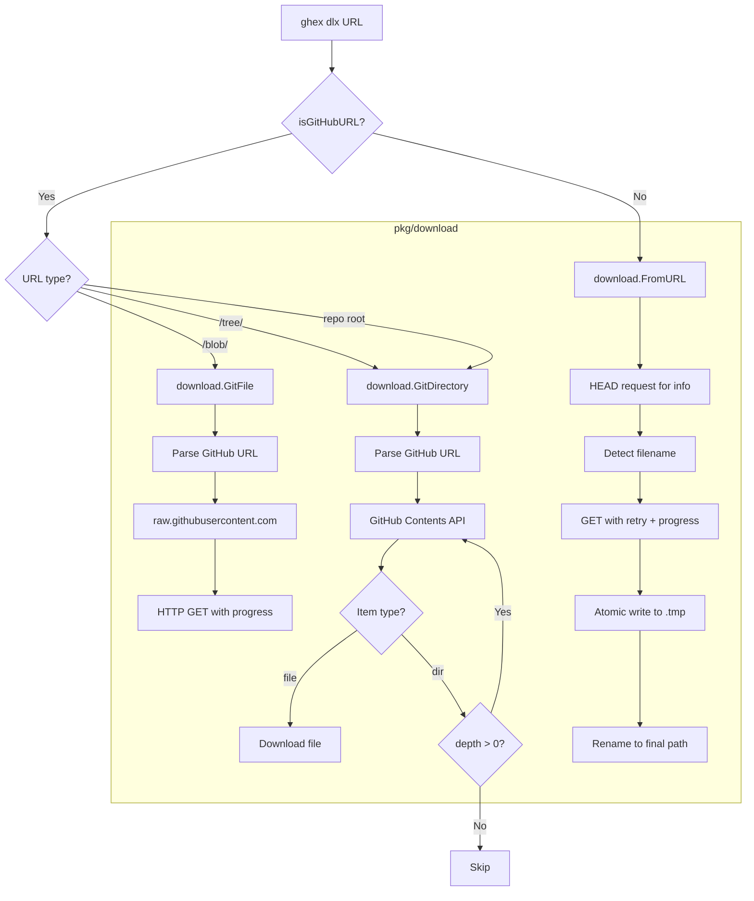

# DLX Feature: Technical Specification & Improvement Plan

## Executive Summary

The `ghex dlx` command is a universal file downloader that supports GitHub URLs (files, directories, releases) and generic HTTP/HTTPS URLs. The CLI command handler (`cmd/ghex/commands/dlx.go`) is fully written and references a `pkg/download` package — **but that package does not exist**. This is the primary blocker: the entire feature is non-functional because the `pkg/download` package must be created from scratch.

This document provides a complete analysis of what the command expects, what must be built, and how to make it production-quality.

---

## 1. Current State Analysis

### 1.1 What Exists

| File | Status | Notes |
|------|--------|-------|
| `cmd/ghex/commands/dlx.go` | ✅ Complete | CLI command structure, flags, routing logic |
| `pkg/download/download.go` | ❌ Missing | Generic HTTP download utilities |
| `pkg/download/github.go` | ❌ Missing | GitHub-specific download functions |

### 1.2 What `dlx.go` Expects from `pkg/download`

The command file imports `github.com/dwirx/ghex/pkg/download` and calls these exported symbols:

#### Types

```go
// Options for generic HTTP downloads
type Options struct {
    Output          string
    OutputDir       string
    Overwrite       bool
    ShowProgress    bool
    ShowInfo        bool
    FollowRedirects bool
}

// GitOptions for GitHub file/directory downloads
type GitOptions struct {
    Branch    string
    Output    string
    OutputDir string
    Depth     int
}

// ReleaseOptions for GitHub release asset downloads
type ReleaseOptions struct {
    Version   string
    Asset     string
    OutputDir string
    ListOnly  bool
}
```

#### Functions

```go
func DefaultOptions() Options
func FromURL(url string, opts Options) error
func Multiple(urls []string, opts Options) error
func GitFile(url string, opts GitOptions) error
func GitDirectory(url string, opts GitOptions) error
func GitRelease(url string, opts ReleaseOptions) error
```

### 1.3 Routing Logic in `dlx.go`

```
ghex dlx <url>
  ├── isGitHubURL(url)?
  │     ├── contains "/blob/" → GitFile()
  │     ├── contains "/tree/" → GitDirectory()
  │     └── else (repo root) → GitDirectory() with depth=100
  └── else → FromURL() (generic HTTP)

ghex dlx file <url>   → GitFile()
ghex dlx dir <url>    → GitDirectory()
ghex dlx release <url> → GitRelease()
ghex dlx list <file>  → Multiple() via downloadFromFileList()
```

### 1.4 Bugs and Issues in `dlx.go`

#### Bug 1: `overwrite` flag silently ignored for GitHub downloads

In [`runGitHubDownload()`](cmd/ghex/commands/dlx.go:189), the `overwrite` flag is read from the command but **never passed** to `GitOptions`. The `GitOptions` struct has no `Overwrite` field in the expected interface.

```go
// dlx.go line 33 — overwrite is read
overwrite, _ := cmd.Flags().GetBool("overwrite")

// dlx.go line 198-202 — overwrite is NOT passed to GitOptions
opts := download.GitOptions{
    Output:    output,
    OutputDir: outputDir,
    // overwrite missing!
}
```

#### Bug 2: `showInfo` flag ignored in `dlx file` and `dlx dir` subcommands

The `file` and `dir` subcommands ([`newDlxFileCmd()`](cmd/ghex/commands/dlx.go:79), [`newDlxDirCmd()`](cmd/ghex/commands/dlx.go:107)) do not have an `--info` flag and do not pass `ShowInfo` to `GitOptions`.

#### Bug 3: `depth` inconsistency between interactive and CLI modes

- CLI `dlx dir` defaults to `depth=10` ([line 130](cmd/ghex/commands/dlx.go:130))
- `runGitHubDownload()` uses `depth=100` ([line 212](cmd/ghex/commands/dlx.go:212))
- Interactive `runDownloadGitDir()` uses `depth=10` ([line 348](cmd/ghex/commands/dlx.go:348))

No single consistent default.

#### Bug 4: `ui.Prompt()` cannot handle spaces in paths

[`ui.Prompt()`](internal/ui/ui.go:139) uses `fmt.Scanln()` which stops at whitespace. File paths with spaces (e.g., `My Documents/file.txt`) will be silently truncated.

#### Bug 5: `isGitHubURL()` accepts `http://` GitHub URLs but GitHub redirects all HTTP to HTTPS

[`isGitHubURL()`](cmd/ghex/commands/dlx.go:181) accepts `http://github.com/` but the GitHub API only works over HTTPS. The raw content URL (`raw.githubusercontent.com`) also requires HTTPS.

#### Bug 6: No exit code on error

[`ui.ShowError()`](internal/ui/ui.go:81) only prints the error — it does not call `os.Exit(1)`. Scripts using `ghex dlx` cannot detect failures via exit code.

#### Bug 7: `downloadFromFileList()` has no concurrency control

[`downloadFromFileList()`](cmd/ghex/commands/dlx.go:228) calls `download.Multiple()` but there is no way to control parallelism from the CLI. A list with 1000 URLs could spawn 1000 goroutines.

---

## 2. `pkg/download` Package Design

### 2.1 Package Structure

```
pkg/download/
├── download.go      # Generic HTTP download (Options, FromURL, Multiple, DefaultOptions)
├── github.go        # GitHub-specific (GitFile, GitDirectory, GitRelease)
├── progress.go      # Progress bar / progress reader
└── errors.go        # Sentinel errors
```

### 2.2 `errors.go` — Sentinel Errors

```go
package download

import "errors"

var (
    ErrInvalidURL       = errors.New("invalid URL")
    ErrNotFound         = errors.New("resource not found (404)")
    ErrForbidden        = errors.New("access forbidden (403) - may require authentication")
    ErrRateLimited      = errors.New("GitHub API rate limit exceeded")
    ErrFileExists       = errors.New("file already exists (use --overwrite to replace)")
    ErrDownloadFailed   = errors.New("download failed")
    ErrGitHubAPI        = errors.New("GitHub API error")
    ErrInvalidGitHubURL = errors.New("invalid GitHub URL format")
    ErrEmptyDirectory   = errors.New("directory is empty or has no downloadable files")
    ErrDepthExceeded    = errors.New("maximum directory depth exceeded")
)
```

### 2.3 `progress.go` — Progress Tracking

The `internal/update` package already has a `progressReader` pattern. The `pkg/download` package should implement a reusable progress bar using the existing `internal/ui` spinner infrastructure.

```go
package download

import (
    "fmt"
    "io"
)

// ProgressWriter wraps an io.Writer to track bytes written
type ProgressWriter struct {
    Writer    io.Writer
    Total     int64
    Current   int64
    OnUpdate  func(current, total int64)
}

func (pw *ProgressWriter) Write(p []byte) (int, error) {
    n, err := pw.Writer.Write(p)
    pw.Current += int64(n)
    if pw.OnUpdate != nil {
        pw.OnUpdate(pw.Current, pw.Total)
    }
    return n, err
}

// FormatProgress returns a human-readable progress string
// e.g., "1.2 MB / 5.0 MB (24%)"
func FormatProgress(current, total int64) string {
    if total <= 0 {
        return fmt.Sprintf("%s downloaded", formatBytes(current))
    }
    pct := float64(current) / float64(total) * 100
    return fmt.Sprintf("%s / %s (%.0f%%)",
        formatBytes(current), formatBytes(total), pct)
}

func formatBytes(b int64) string {
    const unit = 1024
    if b < unit {
        return fmt.Sprintf("%d B", b)
    }
    div, exp := int64(unit), 0
    for n := b / unit; n >= unit; n /= unit {
        div *= unit
        exp++
    }
    return fmt.Sprintf("%.1f %cB", float64(b)/float64(div), "KMGTPE"[exp])
}
```

### 2.4 `download.go` — Generic HTTP Download

#### Key Design Decisions

1. **Atomic writes**: Download to a `.tmp` file first, rename on success. Prevents partial files on failure.
2. **Content-Disposition parsing**: Extract filename from `Content-Disposition` header when `Output` is not specified.
3. **URL-based filename fallback**: Parse the last path segment of the URL as filename.
4. **Retry with exponential backoff**: Retry transient errors (5xx, network timeouts) up to 3 times.
5. **Redirect following**: Respect `FollowRedirects` option; default to following.
6. **Overwrite protection**: Check if file exists before downloading; respect `Overwrite` flag.

```go
package download

import (
    "context"
    "fmt"
    "io"
    "net/http"
    "net/url"
    "os"
    "path/filepath"
    "strings"
    "time"
)

// Options configures a generic HTTP download
type Options struct {
    Output          string        // Output filename (empty = auto-detect)
    OutputDir       string        // Output directory (empty = current dir)
    Overwrite       bool          // Overwrite existing files
    ShowProgress    bool          // Show download progress
    ShowInfo        bool          // Show file info before download
    FollowRedirects bool          // Follow HTTP redirects
    Timeout         time.Duration // HTTP timeout (0 = 30s default)
    Headers         map[string]string // Additional HTTP headers
    MaxRetries      int           // Max retry attempts (0 = 3 default)
    Token           string        // Bearer token for authentication
}

// DefaultOptions returns sensible defaults
func DefaultOptions() Options {
    return Options{
        ShowProgress:    true,
        FollowRedirects: true,
        Timeout:         30 * time.Second,
        MaxRetries:      3,
    }
}

// FromURL downloads a file from a generic HTTP/HTTPS URL
func FromURL(rawURL string, opts Options) error

// Multiple downloads multiple URLs, optionally in parallel
func Multiple(urls []string, opts Options) error
```

#### `FromURL` Implementation Plan

```
1. Validate URL (must be http:// or https://)
2. Create HTTP client (respect FollowRedirects, Timeout)
3. Add auth headers if Token is set
4. HEAD request first (if ShowInfo) to get Content-Length, Content-Type
5. Determine output filename:
   a. Use opts.Output if set
   b. Parse Content-Disposition header
   c. Fall back to URL path last segment
   d. Fall back to "download" if all else fails
6. Determine output path (join OutputDir + filename)
7. Check if file exists → error if !Overwrite
8. Create output directory if needed
9. GET request with retry loop (MaxRetries, exponential backoff)
10. Write to <path>.tmp with ProgressWriter
11. Rename .tmp → final path on success
12. Show success message with file size
```

#### `Multiple` Implementation Plan

```
1. Use golang.org/x/sync/errgroup for bounded concurrency
2. Default concurrency: min(len(urls), 5)
3. Each download runs in its own goroutine
4. Collect all errors, report summary at end
5. Show per-file progress with filename prefix
```

### 2.5 `github.go` — GitHub-Specific Downloads

#### GitHub URL Parsing

GitHub URLs follow these patterns:
- File: `https://github.com/{owner}/{repo}/blob/{ref}/{path}`
- Directory: `https://github.com/{owner}/{repo}/tree/{ref}/{path}`
- Repo root: `https://github.com/{owner}/{repo}`
- Release: `https://github.com/{owner}/{repo}/releases`

Raw content URL: `https://raw.githubusercontent.com/{owner}/{repo}/{ref}/{path}`

GitHub Contents API: `https://api.github.com/repos/{owner}/{repo}/contents/{path}?ref={ref}`

#### Types

```go
// GitOptions configures GitHub file/directory downloads
type GitOptions struct {
    Branch    string // Branch, tag, or commit SHA (empty = default branch)
    Output    string // Output filename override
    OutputDir string // Output directory
    Overwrite bool   // Overwrite existing files
    ShowInfo  bool   // Show file info
    Token     string // GitHub personal access token
    Depth     int    // Max directory recursion depth (0 = unlimited)
}

// ReleaseOptions configures GitHub release downloads
type ReleaseOptions struct {
    Version   string // Tag name or "latest" (empty = latest)
    Asset     string // Asset name filter (glob pattern)
    OutputDir string // Output directory
    ListOnly  bool   // List assets without downloading
    Token     string // GitHub personal access token
    Overwrite bool   // Overwrite existing files
}

// gitHubURL holds parsed components of a GitHub URL
type gitHubURL struct {
    Owner  string
    Repo   string
    Ref    string // branch/tag/commit
    Path   string // file or directory path within repo
    Type   string // "blob", "tree", or ""
}
```

#### `GitFile` Implementation Plan

```
1. Parse GitHub URL → extract owner, repo, ref, path
2. If URL is a blob URL, convert to raw.githubusercontent.com URL
3. If opts.Branch is set, override the ref
4. Determine output path:
   a. If opts.Output is set, use it
   b. Otherwise preserve repo path structure (e.g., skill/SKILL.md)
5. Create output directories as needed
6. Check overwrite
7. Download via raw content URL (no API rate limits for public repos)
8. Show progress if ShowInfo
```

#### `GitDirectory` Implementation Plan

```
1. Parse GitHub URL → extract owner, repo, ref, path
2. Call GitHub Contents API: GET /repos/{owner}/{repo}/contents/{path}?ref={ref}
3. Handle API response:
   a. If array → directory listing
   b. If object with type="file" → single file (redirect to GitFile)
4. For each item in listing:
   a. type="file" → download via raw URL
   b. type="dir" → recurse if depth > 0
5. Preserve directory structure under OutputDir
6. Show progress: "Downloading X files..."
7. Handle rate limiting: check X-RateLimit-Remaining header
8. Support GitHub token via Authorization header
```

#### `GitRelease` Implementation Plan

```
1. Parse repo URL → extract owner, repo
2. Call GitHub Releases API:
   a. If opts.Version == "" or "latest" → GET /repos/{owner}/{repo}/releases/latest
   b. Else → GET /repos/{owner}/{repo}/releases/tags/{version}
3. If opts.ListOnly → print asset table and return
4. Filter assets by opts.Asset (glob match if set)
5. If multiple assets match → show selection menu (interactive) or error (non-interactive)
6. Download selected asset(s) to OutputDir
7. Show checksum verification if checksums.txt exists in release
```

---

## 3. Proposed Improvements

### 3.1 Bug Fixes

| # | Bug | Fix |
|---|-----|-----|
| B1 | `overwrite` flag ignored for GitHub downloads | Add `Overwrite bool` to `GitOptions`; pass it in `runGitHubDownload()` |
| B2 | `showInfo` missing from subcommands | Add `--info` flag to `dlx file` and `dlx dir` subcommands |
| B3 | Inconsistent `depth` defaults | Standardize: default `depth=0` means unlimited; document clearly |
| B4 | `ui.Prompt()` breaks on spaces | Use `bufio.NewReader(os.Stdin).ReadString('\n')` instead of `fmt.Scanln` |
| B5 | `http://` GitHub URLs | Normalize to `https://` before processing |
| B6 | No exit code on error | Call `os.Exit(1)` after `ui.ShowError()` in command handlers |
| B7 | Unbounded concurrency in `Multiple()` | Cap goroutines at `min(len(urls), 5)` using `errgroup` with semaphore |

### 3.2 Missing Features

#### Feature 1: GitHub Authentication (Token Support)

**Problem**: GitHub API has a rate limit of 60 requests/hour for unauthenticated requests. Downloading a large directory can easily exceed this.

**Solution**: 
- Add `--token` / `-t` flag to `dlx`, `dlx file`, `dlx dir`, `dlx release`
- Also read from `GITHUB_TOKEN` environment variable
- Pass token as `Authorization: Bearer <token>` header
- Authenticated limit: 5000 requests/hour

```go
// In dlx.go
token, _ := cmd.Flags().GetString("token")
if token == "" {
    token = os.Getenv("GITHUB_TOKEN")
}
```

#### Feature 2: Progress Bar

**Problem**: No visual feedback during downloads. Users don't know if the tool is working.

**Solution**: Implement a terminal progress bar in `pkg/download/progress.go`:
- For known file sizes: `[████████░░░░] 45% | 2.3 MB / 5.1 MB | 1.2 MB/s | ETA 2s`
- For unknown sizes: spinner + bytes downloaded
- Reuse existing `internal/ui.Spinner` for directory scans
- Use `\r` carriage return to update in-place

#### Feature 3: Retry Logic with Exponential Backoff

**Problem**: Transient network errors cause permanent failures.

**Solution**: In `FromURL()` and GitHub API calls:
```
Attempt 1: immediate
Attempt 2: wait 1s
Attempt 3: wait 2s
Attempt 4: wait 4s (if MaxRetries >= 4)
```
Only retry on: 429 (rate limit), 500, 502, 503, 504, network timeouts.
Do NOT retry on: 401, 403, 404.

#### Feature 4: Checksum Verification for Generic Downloads

**Problem**: No integrity verification for downloaded files.

**Solution**: Add `--checksum` flag accepting `sha256:<hex>` or `md5:<hex>`:
```bash
ghex dlx https://example.com/file.tar.gz --checksum sha256:abc123...
```

#### Feature 5: Resume Interrupted Downloads

**Problem**: Large file downloads that fail must restart from zero.

**Solution**: Support HTTP Range requests:
- Check if `.tmp` file exists from previous attempt
- Send `Range: bytes=<size>-` header
- Append to existing `.tmp` file
- Only works if server sends `Accept-Ranges: bytes`

#### Feature 6: Archive Extraction

**Problem**: Users often download `.tar.gz` or `.zip` files and immediately extract them.

**Solution**: Add `--extract` / `-x` flag:
```bash
ghex dlx https://example.com/archive.tar.gz --extract
```
Supported formats: `.tar.gz`, `.tgz`, `.tar.bz2`, `.zip`

#### Feature 7: Parallel Directory Downloads

**Problem**: `GitDirectory` downloads files sequentially, which is slow for large directories.

**Solution**: Use bounded goroutine pool (default: 5 concurrent downloads):
```go
// In GitDirectory
sem := make(chan struct{}, 5)
var wg sync.WaitGroup
for _, file := range files {
    wg.Add(1)
    go func(f GitHubFile) {
        defer wg.Done()
        sem <- struct{}{}
        defer func() { <-sem }()
        downloadFile(f)
    }(file)
}
wg.Wait()
```

#### Feature 8: Dry Run Mode

**Problem**: Users can't preview what will be downloaded without actually downloading.

**Solution**: Add `--dry-run` flag that lists files that would be downloaded without downloading them.

#### Feature 9: Config File Support

**Problem**: Users must specify `--token` on every command.

**Solution**: Read defaults from `~/.ghex/config.yaml` (already has `internal/config` package):
```yaml
download:
  token: "ghp_..."
  output_dir: "~/Downloads"
  overwrite: false
  max_retries: 3
```

### 3.3 Code Quality Improvements

#### CQ1: URL Parsing — Centralize and Validate

Create a `parseGitHubURL(rawURL string) (*gitHubURL, error)` function that:
- Validates the URL is a proper GitHub URL
- Extracts owner, repo, ref, path, type
- Returns typed errors for invalid formats
- Handles edge cases: trailing slashes, URL-encoded paths, missing ref

#### CQ2: HTTP Client — Reuse and Configure

Create a package-level `newHTTPClient(opts Options) *http.Client` that:
- Sets timeout from opts
- Configures redirect policy
- Sets User-Agent: `ghex/VERSION`
- Reuses connections (keep-alive)

#### CQ3: Error Wrapping — Consistent Pattern

All errors should be wrapped with context:
```go
// Bad
return fmt.Errorf("failed to download")

// Good
return fmt.Errorf("downloading %s: %w", url, ErrDownloadFailed)
```

#### CQ4: Atomic File Writes

Always write to `<path>.tmp` first, then rename:
```go
tmpPath := destPath + ".tmp"
// ... write to tmpPath ...
if err := os.Rename(tmpPath, destPath); err != nil {
    os.Remove(tmpPath)
    return err
}
```

#### CQ5: Context Propagation

All HTTP requests should accept a `context.Context` for cancellation:
```go
func FromURL(ctx context.Context, rawURL string, opts Options) error
```
This enables Ctrl+C cancellation to abort in-flight downloads.

#### CQ6: Structured Logging / Verbose Mode

Add `--verbose` flag that prints:
- Resolved URLs
- HTTP response headers
- Retry attempts
- File sizes and checksums

---

## 4. Implementation Plan

### Phase 1: Core Package (Unblocks Everything)

**Goal**: Create `pkg/download/` so the tool compiles and basic downloads work.

- [ ] Create `pkg/download/errors.go` with sentinel errors
- [ ] Create `pkg/download/progress.go` with `ProgressWriter` and `formatBytes`
- [ ] Create `pkg/download/download.go`:
  - `Options` struct with all fields
  - `DefaultOptions()` function
  - `FromURL()` with atomic writes, filename detection, overwrite check
  - `Multiple()` with bounded concurrency (5 goroutines)
- [ ] Create `pkg/download/github.go`:
  - `GitOptions` and `ReleaseOptions` structs
  - `parseGitHubURL()` internal helper
  - `GitFile()` using raw.githubusercontent.com
  - `GitDirectory()` using GitHub Contents API
  - `GitRelease()` using GitHub Releases API

### Phase 2: Bug Fixes

**Goal**: Fix all identified bugs in `dlx.go`.

- [ ] Fix B1: Add `Overwrite` to `GitOptions`, pass in `runGitHubDownload()`
- [ ] Fix B2: Add `--info` flag to `dlx file` and `dlx dir`
- [ ] Fix B3: Standardize depth default to `0` (unlimited) with documentation
- [ ] Fix B4: Replace `ui.Prompt()` with buffered stdin reader for path inputs
- [ ] Fix B5: Normalize `http://github.com/` to `https://github.com/`
- [ ] Fix B6: Add `os.Exit(1)` after error display in command handlers
- [ ] Fix B7: Already handled in `Multiple()` implementation

### Phase 3: Authentication & Rate Limiting

**Goal**: Make the tool usable for large repositories.

- [ ] Add `--token` flag to all dlx subcommands
- [ ] Read `GITHUB_TOKEN` env var as fallback
- [ ] Pass token through `GitOptions` and `ReleaseOptions`
- [ ] Add rate limit detection: parse `X-RateLimit-Remaining` header
- [ ] Show helpful error when rate limited: "Rate limit exceeded. Set GITHUB_TOKEN for higher limits."
- [ ] Implement retry with exponential backoff for 429 and 5xx responses

### Phase 4: Progress & UX

**Goal**: Make downloads feel responsive and informative.

- [ ] Implement terminal progress bar in `progress.go`
- [ ] Show download speed (bytes/sec) calculated over rolling 1s window
- [ ] Show ETA when file size is known
- [ ] Show file count progress for directory downloads: `[3/15] Downloading config.yaml`
- [ ] Show summary after `Multiple()`: "Downloaded 12 files, 2 failed"
- [ ] Add `--quiet` / `-q` flag to suppress all output except errors

### Phase 5: Advanced Features

**Goal**: Production-quality feature set.

- [ ] Add `--dry-run` flag for preview mode
- [ ] Add `--checksum` flag for integrity verification
- [ ] Add `--extract` / `-x` flag for archive extraction
- [ ] Add resume support for interrupted downloads (Range requests)
- [ ] Add `--concurrency` / `-c` flag to control parallel downloads
- [ ] Integrate with `internal/config` for persistent defaults

### Phase 6: Testing

**Goal**: Ensure correctness and prevent regressions.

- [ ] Unit tests for `parseGitHubURL()` with all URL patterns
- [ ] Unit tests for `formatBytes()` and `FormatProgress()`
- [ ] Unit tests for retry logic with mock HTTP server
- [ ] Unit tests for filename detection from Content-Disposition
- [ ] Integration tests with mock GitHub API server
- [ ] Property-based tests for URL parsing round-trips

---

## 5. API Reference (Final Design)

### `pkg/download/download.go`

```go
package download

// Options configures a generic HTTP download
type Options struct {
    Output          string
    OutputDir       string
    Overwrite       bool
    ShowProgress    bool
    ShowInfo        bool
    FollowRedirects bool
    Timeout         time.Duration
    Headers         map[string]string
    MaxRetries      int
    Token           string
    DryRun          bool
    Quiet           bool
    Concurrency     int
}

func DefaultOptions() Options
func FromURL(rawURL string, opts Options) error
func Multiple(urls []string, opts Options) error
```

### `pkg/download/github.go`

```go
package download

// GitOptions configures GitHub file/directory downloads
type GitOptions struct {
    Branch      string
    Output      string
    OutputDir   string
    Overwrite   bool
    ShowInfo    bool
    Token       string
    Depth       int
    DryRun      bool
    Quiet       bool
    Concurrency int
}

// ReleaseOptions configures GitHub release downloads
type ReleaseOptions struct {
    Version     string
    Asset       string
    OutputDir   string
    ListOnly    bool
    Token       string
    Overwrite   bool
    DryRun      bool
    Quiet       bool
}

func GitFile(url string, opts GitOptions) error
func GitDirectory(url string, opts GitOptions) error
func GitRelease(url string, opts ReleaseOptions) error
```

---

## 6. Architecture Diagram



---

## 7. Key Implementation Notes

### GitHub Contents API Response

```json
[
  {
    "type": "file",
    "name": "README.md",
    "path": "docs/README.md",
    "size": 1234,
    "download_url": "https://raw.githubusercontent.com/owner/repo/main/docs/README.md",
    "sha": "abc123"
  },
  {
    "type": "dir",
    "name": "images",
    "path": "docs/images",
    "download_url": null
  }
]
```

The `download_url` field provides the direct raw content URL — use this instead of constructing raw URLs manually.

### Rate Limit Headers

```
X-RateLimit-Limit: 60
X-RateLimit-Remaining: 45
X-RateLimit-Reset: 1677721600
```

When `X-RateLimit-Remaining` reaches 0, wait until `X-RateLimit-Reset` (Unix timestamp) before retrying.

### Filename Detection Priority

1. `opts.Output` (explicit user override)
2. `Content-Disposition: attachment; filename="file.zip"` header
3. Last path segment of URL (URL-decoded)
4. `"download"` as final fallback

### Atomic Write Pattern

```go
tmpPath := destPath + ".tmp"
defer func() {
    if err != nil {
        os.Remove(tmpPath) // cleanup on failure
    }
}()
// ... write to tmpPath ...
return os.Rename(tmpPath, destPath)
```

### User-Agent Header

All HTTP requests must set:
```
User-Agent: ghex/VERSION (https://github.com/dwirx/ghex)
```

This is required by GitHub API and good practice for all HTTP clients.
