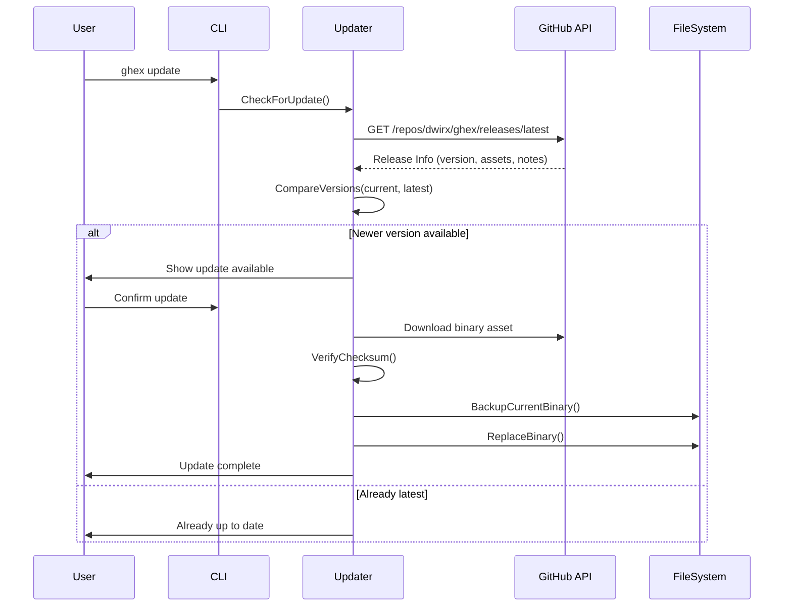

# Design Document: Self-Update Feature

## Overview

Fitur Self-Update memungkinkan ghex untuk mengupdate dirinya sendiri ke versi terbaru dari GitHub Releases. Fitur ini menggunakan GitHub Releases API untuk memeriksa versi terbaru, mengunduh binary yang sesuai dengan platform, memverifikasi integritas file, dan mengganti binary yang sedang berjalan.

## Architecture

```mermaid
flowchart TD
    A[ghex update] --> B{Check Latest Version}
    B --> C[GitHub Releases API]
    C --> D{Compare Versions}
    D -->|Newer Available| E[Download Binary]
    D -->|Up to Date| F[Show "Already Latest"]
    E --> G[Verify Checksum]
    G -->|Valid| H[Backup Current Binary]
    G -->|Invalid| I[Abort & Show Warning]
    H --> J[Replace Binary]
    J --> K[Show Success]
    
    L[ghex update --rollback] --> M{Backup Exists?}
    M -->|Yes| N[Restore Backup]
    M -->|No| O[Show Error]
```

### Component Interaction



## Components and Interfaces

### 1. Update Package (`internal/update/`)

```go
// internal/update/update.go

package update

// ReleaseInfo contains information about a GitHub release
type ReleaseInfo struct {
    Version     string
    TagName     string
    Name        string
    Body        string // Release notes
    PublishedAt time.Time
    Assets      []Asset
    HTMLURL     string
}

// Asset represents a downloadable release asset
type Asset struct {
    Name        string
    DownloadURL string
    Size        int64
    ContentType string
}

// Updater handles self-update operations
type Updater struct {
    CurrentVersion string
    RepoOwner      string
    RepoName       string
    BinaryName     string
}

// NewUpdater creates a new Updater instance
func NewUpdater(currentVersion string) *Updater

// CheckForUpdate checks if a newer version is available
func (u *Updater) CheckForUpdate() (*ReleaseInfo, bool, error)

// Update downloads and installs the latest version
func (u *Updater) Update(release *ReleaseInfo) error

// Rollback restores the previous version from backup
func (u *Updater) Rollback() error

// GetChangelog fetches release notes between versions
func (u *Updater) GetChangelog(fromVersion string) ([]ReleaseInfo, error)
```

### 2. Version Package (`internal/update/version.go`)

```go
// internal/update/version.go

package update

// Version represents a semantic version
type Version struct {
    Major int
    Minor int
    Patch int
    Pre   string // Pre-release identifier (e.g., "beta.1")
}

// ParseVersion parses a version string into Version struct
func ParseVersion(v string) (*Version, error)

// Compare compares two versions
// Returns: -1 if v < other, 0 if v == other, 1 if v > other
func (v *Version) Compare(other *Version) int

// String returns the version as a string
func (v *Version) String() string

// IsNewerThan returns true if v is newer than other
func (v *Version) IsNewerThan(other *Version) bool
```

### 3. GitHub Client (`internal/update/github.go`)

```go
// internal/update/github.go

package update

// GitHubClient handles GitHub API interactions
type GitHubClient struct {
    HTTPClient *http.Client
    BaseURL    string
}

// GetLatestRelease fetches the latest release from GitHub
func (c *GitHubClient) GetLatestRelease(owner, repo string) (*ReleaseInfo, error)

// GetReleases fetches all releases from GitHub
func (c *GitHubClient) GetReleases(owner, repo string) ([]ReleaseInfo, error)

// DownloadAsset downloads a release asset with progress
func (c *GitHubClient) DownloadAsset(asset *Asset, destPath string, progress func(current, total int64)) error
```

### 4. Binary Manager (`internal/update/binary.go`)

```go
// internal/update/binary.go

package update

// BinaryManager handles binary file operations
type BinaryManager struct {
    BinaryPath string
    BackupPath string
}

// GetCurrentBinaryPath returns the path to the running binary
func GetCurrentBinaryPath() (string, error)

// Backup creates a backup of the current binary
func (m *BinaryManager) Backup() error

// Replace replaces the current binary with a new one
func (m *BinaryManager) Replace(newBinaryPath string) error

// Restore restores the binary from backup
func (m *BinaryManager) Restore() error

// HasBackup checks if a backup exists
func (m *BinaryManager) HasBackup() bool

// VerifyChecksum verifies file integrity using SHA256
func VerifyChecksum(filePath string, expectedChecksum string) error

// SetExecutable sets executable permissions on Unix systems
func SetExecutable(filePath string) error
```

### 5. CLI Command (`cmd/ghex/commands/update.go`)

```go
// cmd/ghex/commands/update.go

package commands

// NewUpdateCmd creates the update command
func NewUpdateCmd() *cobra.Command

// Flags:
// --check, -c     Check for updates without installing
// --changelog     Show changelog before updating
// --rollback      Rollback to previous version
// --force, -f     Force update without confirmation
// --yes, -y       Auto-confirm prompts
```

## Data Models

### GitHub Release API Response

```json
{
  "tag_name": "v1.1.0",
  "name": "Release v1.1.0",
  "body": "## What's Changed\n- Feature A\n- Bug fix B",
  "published_at": "2024-01-15T10:00:00Z",
  "html_url": "https://github.com/dwirx/ghex/releases/tag/v1.1.0",
  "assets": [
    {
      "name": "ghex-linux-amd64.tar.gz",
      "browser_download_url": "https://github.com/.../ghex-linux-amd64.tar.gz",
      "size": 5242880,
      "content_type": "application/gzip"
    },
    {
      "name": "checksums.txt",
      "browser_download_url": "https://github.com/.../checksums.txt",
      "size": 512,
      "content_type": "text/plain"
    }
  ]
}
```

### Asset Naming Convention

| Platform | Architecture | Asset Name |
|----------|--------------|------------|
| Linux | amd64 | `ghex-linux-amd64.tar.gz` |
| Linux | arm64 | `ghex-linux-arm64.tar.gz` |
| macOS | amd64 | `ghex-darwin-amd64.tar.gz` |
| macOS | arm64 | `ghex-darwin-arm64.tar.gz` |
| Windows | amd64 | `ghex-windows-amd64.zip` |
| Windows | arm64 | `ghex-windows-arm64.zip` |

### Backup File Location

- Unix: `~/.ghex/backup/ghex.backup`
- Windows: `%APPDATA%\ghex\backup\ghex.exe.backup`

## Correctness Properties

*A property is a characteristic or behavior that should hold true across all valid executions of a system-essentially, a formal statement about what the system should do. Properties serve as the bridge between human-readable specifications and machine-verifiable correctness guarantees.*

### Property 1: Semantic Version Comparison Transitivity

*For any* three valid semantic versions A, B, and C, if A < B and B < C, then A < C must hold. Additionally, for any version V, V == V (reflexivity).

**Validates: Requirements 1.2**

### Property 2: Platform Asset URL Construction

*For any* valid combination of OS (linux, darwin, windows) and architecture (amd64, arm64), the constructed download URL should contain the correct platform identifier and produce a valid URL format.

**Validates: Requirements 2.1**

### Property 3: Checksum Verification Correctness

*For any* file content and its SHA256 hash, VerifyChecksum should return success. For any file content with a different hash, VerifyChecksum should return an error.

**Validates: Requirements 2.3**

### Property 4: Error Handling Preserves Installation

*For any* update operation that fails (download error, checksum mismatch, permission error), the original binary should remain intact and functional.

**Validates: Requirements 2.6, 2.7**

### Property 5: Backup/Restore Round-Trip

*For any* valid binary file, creating a backup and then restoring from that backup should produce a file identical to the original (same content and permissions on Unix).

**Validates: Requirements 5.1, 5.2**

### Property 6: Version Parsing Round-Trip

*For any* valid semantic version string, parsing it to a Version struct and converting back to string should produce an equivalent version string.

**Validates: Requirements 1.2**

## Error Handling

### Error Types

```go
// internal/update/errors.go

var (
    ErrNoUpdateAvailable  = errors.New("already running the latest version")
    ErrDownloadFailed     = errors.New("failed to download update")
    ErrChecksumMismatch   = errors.New("checksum verification failed")
    ErrPermissionDenied   = errors.New("insufficient permissions to update")
    ErrBackupFailed       = errors.New("failed to create backup")
    ErrRestoreFailed      = errors.New("failed to restore from backup")
    ErrNoBackupAvailable  = errors.New("no backup available for rollback")
    ErrInvalidVersion     = errors.New("invalid version format")
    ErrAssetNotFound      = errors.New("no compatible asset found for this platform")
    ErrNetworkError       = errors.New("network error while contacting GitHub")
)
```

### Error Recovery Strategy

1. **Download Failure**: Retry up to 3 times with exponential backoff, then abort
2. **Checksum Mismatch**: Abort immediately, display security warning
3. **Permission Denied**: Detect before update, suggest `sudo` or manual update
4. **Backup Failure**: Abort update, do not proceed without backup
5. **Replace Failure**: Attempt restore from backup if available

## Testing Strategy

### Unit Testing

Unit tests akan menggunakan Go's built-in `testing` package untuk menguji:

- Version parsing dan comparison
- URL construction untuk berbagai platform
- Checksum calculation dan verification
- Error handling scenarios

### Property-Based Testing

Property-based tests akan menggunakan **gopter** (Go Property Testing) library untuk menguji correctness properties:

```go
import "github.com/leanovate/gopter"
import "github.com/leanovate/gopter/gen"
import "github.com/leanovate/gopter/prop"
```

Setiap property-based test harus:
- Dikonfigurasi untuk minimal 100 iterasi
- Di-tag dengan comment yang mereferensikan correctness property dari design document
- Format tag: `**Feature: self-update, Property {number}: {property_text}**`

### Test Categories

1. **Version Tests** (`internal/update/version_test.go`)
   - Property test: version comparison transitivity
   - Property test: version parsing round-trip
   - Unit test: edge cases (pre-release versions, invalid formats)

2. **Checksum Tests** (`internal/update/checksum_test.go`)
   - Property test: checksum verification correctness
   - Unit test: empty file, large file handling

3. **Binary Manager Tests** (`internal/update/binary_test.go`)
   - Property test: backup/restore round-trip
   - Unit test: permission handling, Windows-specific behavior

4. **Platform Tests** (`internal/update/platform_test.go`)
   - Property test: asset URL construction
   - Unit test: all supported platform combinations

5. **Integration Tests** (`internal/update/update_integration_test.go`)
   - End-to-end update flow with mock GitHub API
   - Rollback scenario testing
